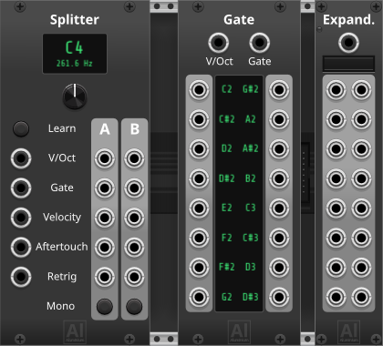
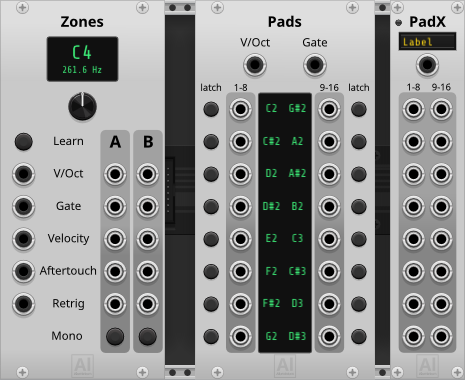
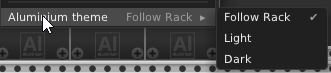
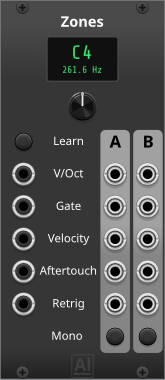
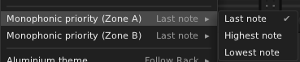
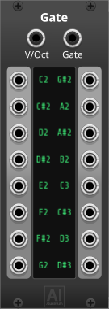
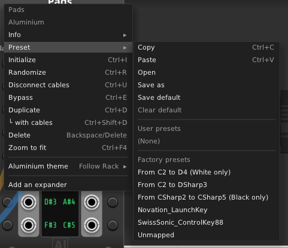
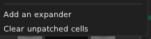
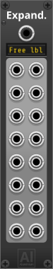
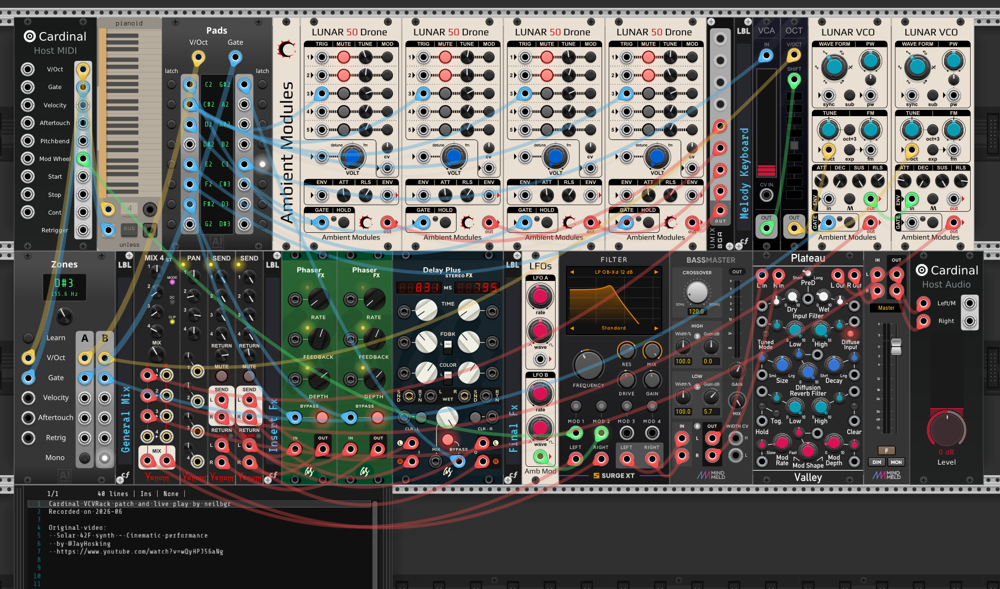

# Aluminium — User Manual

**Aluminium** is a small collection of MIDI-CV utility modules for VCV Rack / Cardinal, all built around one goal: getting more out of real MIDI keyboards and controllers in a live performance patch, beyond what Rack's core **MIDI-CV** module alone gives you. That covers a wide range of setups — from the simplest one, owning a single MIDI master keyboard on one channel and wanting to split it into two or more independently-playable zones, all the way up to a rig built around an advanced controller with velocity- and polyphonic-aftertouch-sensitive pads, where every pad becomes its own fully expressive CV voice.

- **Zones** turns that one keyboard into as many independent note-range zones as you want. Chain several Zones modules together (feed one zone's output into the next one's input) and you can cut the keyboard into 3, 4, or more zones — each usable on its own as a polyphonic or true-legato monophonic voice.
- **Pads** and its expander (**PadX**) exist for live performance with MIDI pad controllers: patch in a controller whose pads are velocity- and/or polyphonic-aftertouch-sensitive, learn each pad once, and every pad becomes its own independent, fully expressive CV voice — gate, velocity, aftertouch, whatever lane you need — with no MIDI-mapping software and no hand-built V/OCT comparison logic. The same trick works just as well on a handful of keys reserved off the end of an ordinary keyboard (after a split, if the rest is still being played melodically), and nothing ties either module to a single input — feed one Pads module from one controller's pads while a Zones output handles another controller's keys, and build a full live rig from several MIDI controllers at once, all inside the same patch. Any cell can also be switched to Latch mode, turning a press into an on/off toggle instead of a hold.

| Module                 | What it does                                                                    |
|-------------------------|----------------------------------------------------------------------------------|
| [Zones](#zones)         | Splits one polyphonic MIDI-CV stream into two note-range zones, each poly or mono |
| [Pads](#pads)           | 16 gate outputs, one per learned note, from a poly V/OCT + GATE cable            |
| [PadX](#padx)           | Pads expander: mirrors its note mapping onto a freely-labeled poly lane |

## Table of Contents

- [Panel themes](#panel-themes)
- [Right-click menu](#right-click-menu)
- [Shared conventions](#shared-conventions)
- [Zones](#zones)
- [Pads](#pads)
- [PadX](#padx)
- [Example patch: 49-key live performance](#example-patch-49-key-live-performance)

## Panel themes

Every Aluminium panel follows one shared **Follow Rack / Light / Dark** setting (see [Right-click menu](#right-click-menu) below), independent of Rack's own "Dark panels" preference. Unlike a per-module theme, this one is shared pack-wide — there's only ever one Aluminium theme active at a time, and it applies to every Aluminium module.

### Light

### Dark

## Right-click menu

Right-click any Aluminium module to open its context menu. One entry is identical across all 3 modules:

- **Aluminium theme** — a submenu to switch between *Follow Rack*, *Light*, and *Dark*. Because this setting is shared pack-wide (see [Panel themes](#panel-themes) above), changing it from **any** Aluminium module's menu re-themes **every** Aluminium module currently in the patch, in one step — there's no separate "apply to all" action to trigger, it always applies to the whole pack, immediately.

Zones adds two more entries of its own (documented under [Zones](#zones)), and Pads adds one more (documented under [Pads](#pads)). PadX has no other entries — its label is edited directly on the panel, not via the menu.

## Shared conventions

- **V/OCT.** Pitch follows the standard 1 volt per octave convention (0V = C4), like any other Rack oscillator or sequencer.
- **Where inputs come from.** Every Aluminium input in this pack expects the polyphonic outputs of Rack/Cardinal's own core **MIDI-CV** module (V/OCT, GATE, VELOCITY, AFTERTOUCH, RETRIGGER) — either patched directly, or via one of Zones' own outputs, which carry the same 5 signals split by note range.
- **16-channel cap.** Every module in this pack follows Rack's own 16-channel polyphony limit — inputs/zones/cells beyond the 16th incoming channel are simply not read.

## Zones

Splits one polyphonic MIDI-CV stream into two note-range zones — Zone A (below the split point) and Zone B (at/above it) — each independently switchable between a straight polyphonic passthrough and a single monophonic voice.

**Mono mode is the real reason this module exists.** A single MIDI keyboard is polyphonic hardware, but a huge amount of classic synth voicing — basslines, leads, anything meant to be played legato — wants a genuinely monophonic CV/gate pair instead. Naively reducing a polyphonic stream to one voice usually retriggers the envelope on *every* new key-press, including the moment you release an overlapping note and the synth voice falls back to whichever other note was still being held — which is exactly the kind of glitch that makes rolled chords or legato phrasing sound broken. Zone A/B's Mono switch avoids that entirely: gate stays high continuously across overlapping held notes (true legato, only dropping once the zone is completely empty), and a retrigger pulse fires only for a genuinely new key-press — never when the audible note merely falls back to one already held. That's what makes a single ordinary keyboard usable as a proper monophonic performance controller, split into as many independently-played zones as you like.

**Knobs & switches**
- **Split point** — the note at/above which incoming notes fall into Zone B (below it, Zone A). Its live note-name + frequency readout above the knob doubles as a right-click-editable text field: type a note name (`C4`, `F#3`, `Bb2`, …) directly instead of dialing it in.
- **Learn** (lit button) — arms the module to set the split point from the very next note played on the Pitch input, instead of dialing the knob by hand. That learning note itself is excluded from the outputs (it never plays through); only notes played after Learn turns back off do. Click the lit button again to cancel learning without playing a note.
- **Zone A mode** / **Zone B mode** (lit buttons) — *Polyphonic* (passthrough of that zone's own channels, unchanged channel indices, so downstream polyphonic modules never see a spurious retrigger) or *Monophonic* (a single, true-legato voice — see above — reduced per that zone's priority rule below).

**Inputs**
- **V/OCT**, **Gate**, **Velocity**, **Aftertouch**, **Retrigger** — the 5 polyphonic lanes from Core MIDI-CV (or an upstream Zones module's own zone outputs).

**Outputs** (×2, one set per zone)
- **V/OCT**, **Gate**, **Velocity**, **Aftertouch**, **Retrigger** — Zone A's and Zone B's own copies of the 5 input lanes, filtered/reduced per that zone's mode.

**Lights**
- **Learn** (red) — lit while Learn is armed and waiting for a note.
- **Zone A / Zone B mode** (white, built into the mode buttons) — lit while that zone is in Monophonic mode.

**Context menu**
- **Zone A priority (when monophonic)** / **Zone B priority (when monophonic)** — which held note plays when that zone is in Monophonic mode and more than one note overlaps: *Last note*, *Highest note*, or *Lowest note*.

**Patch ideas**
- The one-keyboard, one-MIDI-channel setup this module exists for: patch Core MIDI-CV straight into one Zones module to get a simple upper/lower keyboard split, or chain two or three together to build several independent zones — bass on the lowest, chords in the middle, lead on top — all from a single physical keyboard.
- Set a zone to Monophonic with *Highest note* priority for a simple top-note lead line while still holding chords underneath in the other (Polyphonic) zone.
- Set the bass zone to Monophonic with *Last note* priority and play it legato (overlapping key presses) for true monosynth-style basslines, gate and envelope behaving exactly like a real analog mono synth would expect.

## Pads

Its headline use case is live performance with a MIDI pad controller — an Akai MPD/MPC-style pad grid, a Novation Launchpad Pro, an Ableton Push, or any other velocity- and/or polyphonic-aftertouch-sensitive controller (see Patch ideas below): learn each pad once and it becomes its own independently expressive CV voice.

Technically, it's like Cardinal/Rack core's **MIDI-Gate** module, but driven by a polyphonic V/OCT + GATE cable instead of MIDI directly (typically from Core MIDI-CV, or from one of Zones' zones) — 16 gate outputs, one per learned note. Each output goes high whenever any incoming polyphonic channel currently carries that exact note with its gate high.

**The note display**

The 2×8 grid in the middle is the whole module: each of its 16 cells shows the note currently learned for that gate output ("--" if unassigned), and is how you (re)assign it — two ways:

- **Learn by playing.** Click a cell — it highlights to show it's armed and waiting — then play the note you want on the incoming V/OCT + GATE cable; the cell captures it and stops waiting.
- **Type it in.** Click a cell to select it, then type the note directly: a letter key `A`–`G` sets the note name, `#` sharpens it, and a digit key sets the octave; press **Enter** to commit, or **Backspace**/**Delete** at any point to clear the cell back to "--" (that output then stays permanently low).

**Ctrl+click** a cell instead of a plain click to arm it for *sequential* learning — this applies to both methods above: each time a note is captured (played, or typed and confirmed with Enter), the next cell arms automatically and stays selected/armed for more, instead of leaving learn mode. That lets a whole row of pads be assigned back-to-back — from a controller or the computer keyboard — without reclicking between cells; it stops arming automatically after the 16th cell.

Either way, **Esc**, clicking the still-armed cell again, or clicking anywhere else in Rack cancels — the cell keeps whatever note it had before, nothing is committed. Hovering the display shows a tooltip with this same rundown.

Each cell also shows live gate activity right there, even when nothing is patched into its output: a short line above the note name lights up while that note is currently held on the incoming cable, and a line below lights up while the cell's output is actually high. Normally the two move together; with that cell's Latch on (see below), they can diverge — releasing a latched-on note turns the top line off while the bottom one stays lit, showing the output is still latched high.

Assigning a note to one cell automatically clears it from any other cell that held it — the same note is never mapped to two outputs at once. Fresh from the module browser (or after a reset), the 16 cells default to one chromatic run starting at C2 (cell 1 = C2, cell 2 = C#2, … up through cell 16 = D#3) — a reasonable starting point to re-learn from, not something to rely on.

The left column of ports (outputs 1–8, top to bottom) feeds from the display's left column of cells; the right column of ports (outputs 9–16) feeds from the display's right column, in the same top-to-bottom order.

**Latch buttons**

Each cell also has its own Latch button, one on each outer edge of the panel, aligned with that cell's row. Unlit (the default) is the ordinary behavior described above — gate follows the held note directly. Lit, that cell's gate output *latches* instead: it toggles on or off each time the note is played again, and stays put in between, regardless of how long the note is held or released — useful for a hands-free on/off toggle (mute a channel, open/close a filter, alternate a hi-hat between open and closed) from a single pad hit. Learning a new note into a cell, or clearing it, always resets that cell's Latch button back to off, so a stale toggle from whatever was learned there before never carries over.

**Factory presets**

Right-click → **Preset** → **Factory presets** offers ready-made note mappings, so common setups don't need learning cell by cell:

- **From C2 to D4 (White only)**, **From C2 to DSharp3**, **From CSharp2 to CSharp5 (Black only)** — generic note-range starting points (full chromatic run, or white/black keys only) for reserving a block of ordinary keyboard keys as pads (see Patch ideas below), instead of dialing in each cell by hand.
- **Novation_LaunchKey**, **SwissSonic_ControlKey88** — the stock pad mapping for those specific keyboard/pad controllers, straight from their own documentation.
- **Unmapped** — all 16 cells cleared to "--", a clean slate.

**Inputs**
- **V/OCT**, **Gate** — the polyphonic pitch/gate pair to learn notes from and gate against (from Core MIDI-CV, or a Zones output).

**Outputs**
- **Gate 1–16** — one gate per learned cell, high (10V) whenever some incoming channel currently holds that exact note with its gate high (or, in Latch mode, whenever that cell is currently toggled on), low (0V) otherwise (including for any cell left at "--").

**Lights**
- **Latch 1–16** (built into the Latch buttons) — lit while that cell is in Latch mode.

**Context menu**

- **Add an expander** — creates a PadX immediately to the right of Pads, or to the right of the last expander already chained there if one or more are already attached. Add as many as you need, one per poly lane, in any order — give each one its own name via its on-panel label field, see [PadX](#padx) below for how the chain works.
- **Clear unpatched cells** — sets every cell back to "--" whose Gate output has no cable plugged in, in one step. Leaves patched cells alone, so it's a quick way to drop leftover cells from a factory preset or an earlier setup that this patch never actually uses, without hand-clearing each one (click, Backspace).

**Patch ideas**
- Patch a MIDI pad controller's Core MIDI-CV output into Pads, learn each pad once, then add a [PadX](#padx) per lane you want — one labeled "Velocity", one labeled "Aftertouch" — so gate triggers a drum module, velocity sets its level, and aftertouch modulates a filter, all live and independently per pad.
- No dedicated pad controller? Reserve a few keys at one end of an ordinary keyboard instead (after splitting them off with [Zones](#zones), if the rest is still being played melodically) and learn each one into Pads — every key becomes its own ready-to-patch gate output, without building your own per-note V/OCT comparison logic the way Core's own MIDI-Gate/MIDI-CV combination would otherwise take.
- Running more than one MIDI controller? Feed each into its own Pads module (or Zones output) for a full live rig — drum pads on one controller, melodic zones on another — in the same patch at once.
- Switch a pad's Latch button on to turn a normally momentary hit into an on/off toggle — hit once to open a filter or unmute a channel, hit again to close it, hands-free for the rest of the section.

## PadX

A Pads expander: extracts whatever polyphonic cable is patched into its single input (from Core MIDI-CV, or a Zones output) into 16 mono outputs, one per note Pads has learned — output *N* always carries the value of whichever note is currently learned into Pads' cell *N*. The module itself doesn't care which lane that is (Velocity, Aftertouch, Retrigger, or anything else poly) — that's purely a matter of which cable you patch in.

Place it directly to the right of Pads — or to the right of another PadX already chained there (see [Pads](#pads)'s context menu above); add as many instances as you need, one per lane, in any order — they all relay the same mapping onward to whichever others follow them.

**Label**
- The single-line field on the panel is a freely-editable text label (click it and type) — it doesn't affect the signal path at all, it's just how you keep track of what you patched into this instance (e.g. "Velocity", "Aftertouch", "Retrigger", or any name you like). It's empty by default, and saved with the patch.
- The first time you patch a cable into this instance's input while the label is still empty, it's auto-filled from that cable's source (its first 8 characters, e.g. patching Core MIDI-CV's Velocity output fills in "Velocity"). Unpatching that cable clears the label back to empty automatically — but only for a label that was auto-filled this way; once you've typed your own text over it, unpatching leaves it alone.

**Inputs**
- **Lane** — the polyphonic lane to read from, named after the label above.

**Outputs**
- **Lane 1–16** — that note's current value on the patched-in lane (0V while its cell is unassigned, its note isn't currently held, or the input's channel count doesn't reach that cell's channel — see Lights below).

**Lights** — one status LED, showing one of three colors at a time (hover it for a tooltip covering all three):
- **Yellow** — chained to Pads (directly or through other expanders), but nothing patched into this instance's own input yet.
- **Red** — chained and patched in, but this instance's own cable has a different channel count than Pads' V/OCT + Gate cable; outputs for cells beyond its channel count read 0V instead of whatever note Pads has learned there.
- **Green** — chained, patched in, and channel counts match: fully working.

**Patch ideas** — see [Pads](#pads) above.

## Example patch: 49-key live performance

[`docs/Patch_49keys.vcv`](docs/Patch_49keys.vcv) is a real performance patch built around [AmbientModules](https://github.com/neilbgr/AmbientModules), showing Zones and Pads working together to replace hardware that an ordinary 49-key MIDI keyboard doesn't have.

The original patch this recreates was designed for a transposable keyboard with 7 assignable pads and 1 slider in active use:

- 4 pads, each triggering one of four Lunar50Drone voices
- 1 pad toggling the 3rd oscillator on/off across all 4 drones at once
- 1 pad toggling a Phaser effect
- 1 pad toggling a Delay effect
- 1 slider controlling a low-pass filter's cutoff

This patch reproduces every one of those controls from the keyboard's own keys, pitch bend, and mod wheel alone — no pads or extra controller needed:

- **Zones** splits the keyboard at **D#3**: Zone A (below D#3) takes over the role of the 7 pads, Zone B (at/above D#3) stays the ordinary melodic keyboard.
- **Pads**, fed from Zone A, has each of Zone A's keys learned as a dedicated trigger, mirroring the original 7-pad layout (the 4 drones, the oscillator-3 toggle, the Phaser toggle, the Delay toggle) — with **C3 switched to Latch mode**, used to transpose Zone B up an octave on the fly during the performance, standing in for the transposable keyboard's own transpose control.
- The low-pass filter cutoff, originally on a slider, is instead mapped to the keyboard's built-in **mod wheel**.

