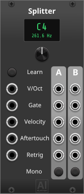

# Aluminium — User Manual

**Aluminium** is a small collection of MIDI-CV utility modules for VCV Rack / Cardinal, born out of a very unglamorous real-world problem: owning only one MIDI master keyboard, one that transmits on a single channel, and wanting more out of it than Rack's core **MIDI-CV** module alone gives you.

- **Al Splitter** turns that one keyboard into as many independent note-range zones as you want. Chain several Al Splitters together (feed one zone's output into the next Al Splitter's input) and you can cut the keyboard into 3, 4, or more zones — each usable on its own as a polyphonic or true-legato monophonic voice.
- **Al Gate** and its three expanders (**Al Velocity Expander**, **Al Aftertouch Expander**, **Al Retrigger Expander**) solve a different flavor of the same problem: a keyboard with no drum pads. Reserve a handful of keys — after a split, if the rest of the keyboard is still being played melodically — and Al Gate turns each one into its own dedicated gate output: one gate per learned note, instead of building your own V/OCT comparison logic the way Core's own MIDI-Gate module would otherwise require. Add the expanders alongside it to also pull out that same note's velocity and/or (polyphonic) aftertouch. The same combination doubles as a clean way to map an external MIDI controller with velocity- and poly-aftertouch-sensitive pads straight through to independent CV, one lane per pad.

| Module                            | What it does                                                                    |
|------------------------------------|----------------------------------------------------------------------------------|
| [Al Splitter](#al-splitter)       | Splits one polyphonic MIDI-CV stream into two note-range zones, each poly or mono |
| [Al Gate](#al-gate)               | 16 gate outputs, one per learned note, from a poly V/OCT + GATE cable            |
| [Al Velocity Expander](#al-velocity-expander)     | Al Gate expander: mirrors its note mapping onto a poly VELOCITY cable   |
| [Al Aftertouch Expander](#al-aftertouch-expander) | Al Gate expander: mirrors its note mapping onto a poly AFTERTOUCH cable |
| [Al Retrigger Expander](#al-retrigger-expander)   | Al Gate expander: mirrors its note mapping onto a poly RETRIGGER cable |

## Table of Contents

- [Panel themes](#panel-themes)
- [Right-click menu](#right-click-menu)
- [Shared conventions](#shared-conventions)
- [Al Splitter](#al-splitter)
- [Al Gate](#al-gate)
- [Al Velocity Expander](#al-velocity-expander)
- [Al Aftertouch Expander](#al-aftertouch-expander)
- [Al Retrigger Expander](#al-retrigger-expander)

## Panel themes

Every Aluminium panel follows one shared **Follow Rack / Light / Dark** setting (see [Right-click menu](#right-click-menu) below), independent of Rack's own "Dark panels" preference. Unlike a per-module theme, this one is shared pack-wide — there's only ever one Aluminium theme active at a time, and it applies to every Aluminium module.

### Light

### Dark

## Right-click menu

Right-click any Aluminium module to open its context menu. One entry is identical across all 5 modules:

- **Aluminium theme** — a submenu to switch between *Follow Rack*, *Light*, and *Dark*. Because this setting is shared pack-wide (see [Panel themes](#panel-themes) above), changing it from **any** Aluminium module's menu re-themes **every** Aluminium module currently in the patch, in one step — there's no separate "apply to all" action to trigger, it always applies to the whole pack, immediately.

Al Splitter adds two more entries of its own (documented under [Al Splitter](#al-splitter)), and Al Gate adds three more (documented under [Al Gate](#al-gate)). Al Velocity Expander, Al Aftertouch Expander, and Al Retrigger Expander have no other entries.

## Shared conventions

- **V/OCT.** Pitch follows the standard 1 volt per octave convention (0V = C4), like any other Rack oscillator or sequencer.
- **Where inputs come from.** Every Aluminium input in this pack expects the polyphonic outputs of Rack/Cardinal's own core **MIDI-CV** module (V/OCT, GATE, VELOCITY, AFTERTOUCH, RETRIGGER) — either patched directly, or via Al Splitter's own zone outputs, which carry the same 5 signals split by note range.
- **16-channel cap.** Every module in this pack follows Rack's own 16-channel polyphony limit — inputs/zones/cells beyond the 16th incoming channel are simply not read.

## Al Splitter

Splits one polyphonic MIDI-CV stream into two note-range zones — Zone A (below the split point) and Zone B (at/above it) — each independently switchable between a straight polyphonic passthrough and a single monophonic voice.

**Mono mode is the real reason this module exists.** A single MIDI keyboard is polyphonic hardware, but a huge amount of classic synth voicing — basslines, leads, anything meant to be played legato — wants a genuinely monophonic CV/gate pair instead. Naively reducing a polyphonic stream to one voice usually retriggers the envelope on *every* new key-press, including the moment you release an overlapping note and the synth voice falls back to whichever other note was still being held — which is exactly the kind of glitch that makes rolled chords or legato phrasing sound broken. Zone A/B's Mono switch avoids that entirely: gate stays high continuously across overlapping held notes (true legato, only dropping once the zone is completely empty), and a retrigger pulse fires only for a genuinely new key-press — never when the audible note merely falls back to one already held. That's what makes a single ordinary keyboard usable as a proper monophonic performance controller, split into as many independently-played zones as you like.

**Knobs & switches**
- **Split point** — the note at/above which incoming notes fall into Zone B (below it, Zone A). Its live note-name + frequency readout above the knob doubles as a right-click-editable text field: type a note name (`C4`, `F#3`, `Bb2`, …) directly instead of dialing it in.
- **Learn** (lit button) — arms the module to set the split point from the very next note played on the Pitch input, instead of dialing the knob by hand. That learning note itself is excluded from the outputs (it never plays through); only notes played after Learn turns back off do. Click the lit button again to cancel learning without playing a note.
- **Zone A mode** / **Zone B mode** (lit buttons) — *Polyphonic* (passthrough of that zone's own channels, unchanged channel indices, so downstream polyphonic modules never see a spurious retrigger) or *Monophonic* (a single, true-legato voice — see above — reduced per that zone's priority rule below).

**Inputs**
- **V/OCT**, **Gate**, **Velocity**, **Aftertouch**, **Retrigger** — the 5 polyphonic lanes from Core MIDI-CV (or an upstream Al Splitter's zone outputs).

**Outputs** (×2, one set per zone)
- **V/OCT**, **Gate**, **Velocity**, **Aftertouch**, **Retrigger** — Zone A's and Zone B's own copies of the 5 input lanes, filtered/reduced per that zone's mode.

**Lights**
- **Learn** (red) — lit while Learn is armed and waiting for a note.
- **Zone A / Zone B mode** (white, built into the mode buttons) — lit while that zone is in Monophonic mode.

**Context menu**
- **Zone A priority (when monophonic)** / **Zone B priority (when monophonic)** — which held note plays when that zone is in Monophonic mode and more than one note overlaps: *Last note*, *Highest note*, or *Lowest note*.

**Patch ideas**
- The one-keyboard, one-MIDI-channel setup this module exists for: patch Core MIDI-CV straight into one Al Splitter to get a simple upper/lower keyboard split, or chain two or three together to build several independent zones — bass on the lowest, chords in the middle, lead on top — all from a single physical keyboard.
- Set a zone to Monophonic with *Highest note* priority for a simple top-note lead line while still holding chords underneath in the other (Polyphonic) zone.
- Set the bass zone to Monophonic with *Last note* priority and play it legato (overlapping key presses) for true monosynth-style basslines, gate and envelope behaving exactly like a real analog mono synth would expect.

## Al Gate

Like Cardinal/Rack core's **MIDI-Gate** module, but driven by a polyphonic V/OCT + GATE cable instead of MIDI directly (typically from Core MIDI-CV, or from one of Al Splitter's zones) — 16 gate outputs, one per learned note. Each output goes high whenever any incoming polyphonic channel currently carries that exact note with its gate high.

**The note display**

The 2×8 grid in the middle is the whole module: each of its 16 cells shows the note currently learned for that gate output ("--" if unassigned), and is how you (re)assign it — two ways:

- **Learn by playing.** Click a cell — it highlights to show it's armed and waiting — then play the note you want on the incoming V/OCT + GATE cable; the cell captures it and stops waiting. Click the same (still-armed) cell again instead of playing a note to cancel the learn and leave it unchanged.
- **Type it in.** Click a cell to select it, then type the note directly: a letter key `A`–`G` sets the note name, `#` sharpens it, and a digit key sets the octave; press **Enter** to commit, or **Backspace**/**Delete** at any point to clear the cell back to "--" (that output then stays permanently low). Selecting a different cell or clicking elsewhere without pressing Enter discards whatever was typed so far.

Assigning a note to one cell automatically clears it from any other cell that held it — the same note is never mapped to two outputs at once. Fresh from the module browser (or after a reset), the 16 cells default to one chromatic run starting at C2 (cell 1 = C2, cell 2 = C#2, … up through cell 16 = D#3) — a reasonable starting point to re-learn from, not something to rely on.

The left column of ports (outputs 1–8, top to bottom) feeds from the display's left column of cells; the right column of ports (outputs 9–16) feeds from the display's right column, in the same top-to-bottom order.

**Inputs**
- **V/OCT**, **Gate** — the polyphonic pitch/gate pair to learn notes from and gate against (from Core MIDI-CV, or an Al Splitter zone).

**Outputs**
- **Gate 1–16** — one gate per learned cell, high (10V) whenever some incoming channel currently holds that exact note with its gate high, low (0V) otherwise (including for any cell left at "--").

**Context menu**

Adds its expanders directly, already cabled and positioned, instead of pulling each one from the module browser and connecting it by hand:

- **Add Al Velocity Expander** / **Add Al Aftertouch Expander** / **Add Al Retrigger Expander** — creates that expander immediately to the right of Al Gate, or to the right of the last expander already chained there if one or more are already attached. All three can be added at once, in any order — see [Al Velocity Expander](#al-velocity-expander) below for how the chain works.

**Patch ideas**
- Reserve a few keys at one end of your keyboard (after splitting them off with [Al Splitter](#al-splitter), if the rest is still being played melodically) and learn each one into Al Gate — every key becomes its own ready-to-patch gate output, without building your own per-note V/OCT comparison logic the way Core's own MIDI-Gate/MIDI-CV combination would otherwise take. Perfect for triggering a handful of drum/percussion modules directly, one key per drum.
- Add [Al Velocity Expander](#al-velocity-expander) and/or [Al Aftertouch Expander](#al-aftertouch-expander) alongside it to pull out that same note's velocity and (polyphonic) aftertouch too — useful even from a plain keyboard, and just as much a clean way to map an external MIDI controller with velocity-sensitive, polyphonic-aftertouch-sensitive pads straight through to independent CV per pad.

## Al Velocity Expander

An Al Gate expander: mirrors Al Gate's current note-to-channel mapping onto a polyphonic **Velocity** cable (from Core MIDI-CV, or an Al Splitter zone), producing the corresponding velocity on each of its own 16 outputs — output *N* always carries the velocity of whichever note is currently learned into Al Gate's cell *N*.

Place it directly to the right of Al Gate — or to the right of another Al Gate expander already chained there (see [Al Gate](#al-gate)'s context menu above); order among Al Velocity Expander/Al Aftertouch Expander/Al Retrigger Expander doesn't matter, they all relay the same mapping onward to whichever of the other two follow them.

**Inputs**
- **Velocity** — the polyphonic velocity lane to read from.

**Outputs**
- **Velocity 1–16** — that note's current velocity (0V while its cell is unassigned or its note isn't currently held).

**Lights**
- **Connected** (yellow) — lit whenever Al Gate (or another chained expander leading back to one) is present immediately to the left.

**Patch ideas** — see [Al Gate](#al-gate) above.

## Al Aftertouch Expander

Identical to [Al Velocity Expander](#al-velocity-expander) above, just reading the polyphonic **Aftertouch** lane instead — output *N* carries the current (polyphonic) aftertouch of whichever note is learned into Al Gate's cell *N*.

**Inputs**
- **Aftertouch** — the polyphonic aftertouch lane to read from.

**Outputs**
- **Aftertouch 1–16** — that note's current aftertouch (0V while its cell is unassigned or its note isn't currently held).

**Lights**
- **Connected** (yellow) — lit whenever Al Gate (or another chained expander leading back to one) is present immediately to the left.

**Patch ideas** — see [Al Gate](#al-gate) above.

## Al Retrigger Expander

Identical to [Al Velocity Expander](#al-velocity-expander) above, just reading the polyphonic **Retrigger** lane instead — output *N* pulses whenever the note learned into Al Gate's cell *N* retriggers (a same-pitch re-strike that never drops gate, per Core MIDI-CV's own "Reuse" retrigger convention).

**Inputs**
- **Retrigger** — the polyphonic retrigger lane to read from.

**Outputs**
- **Retrigger 1–16** — a retrigger pulse for that note (silent while its cell is unassigned or its note isn't currently held).

**Lights**
- **Connected** (yellow) — lit whenever Al Gate (or another chained expander leading back to one) is present immediately to the left.

**Patch ideas** — see [Al Gate](#al-gate) above.
